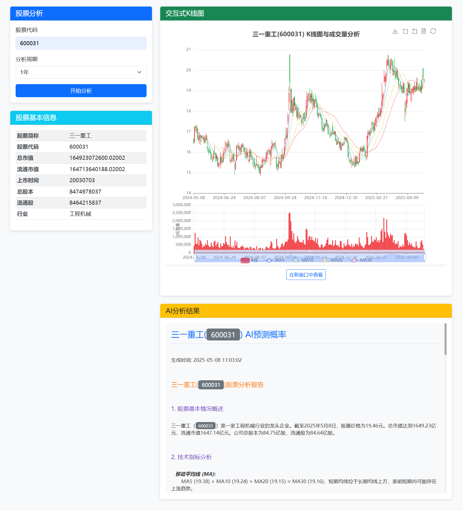

# AI看线 - 股票技术分析与AI预测工具

<div align="center">
  <a href="README_EN.md">English</a> | <a href="README.md">中文</a>
</div>

## 项目简介

AI看线是一个基于Python的A股分析工具，结合传统技术分析和人工智能预测功能。利用K线图、技术指标、财务数据和新闻信息对股票进行全面分析及预测。

### 功能特点

- **数据获取**：使用AKShare和腾讯API获取A股股票的实时行情、历史交易数据、财务数据和新闻信息
- **技术分析**：计算多种技术指标，包括MA、MACD、KDJ、RSI、布林带等
- **可视化**：生成K线图和技术指标可视化图表
- **AI分析**：利用DeepSeek AI分析股票数据并预测未来走势和上涨概率
- **Web界面**：提供简洁美观的Web界面，方便用户输入股票代码查看分析结果

## 技术栈

- **后端**：Flask Web框架
- **数据源**：AkShare、腾讯行情API
- **AI分析**：DeepSeek API (grok-2-vision)
- **可视化**：Matplotlib、ECharts

## 项目结构

```
STOCK_AI/
├── stock_app.py              # Flask主应用入口
├── requirements.txt          # 依赖包列表
├── .env.example              # 环境变量模板
├── modules/
│   ├── data_fetcher.py       # 数据获取模块
│   ├── technical_analyzer.py # 技术分析模块
│   ├── visualizer.py          # 可视化模块
│   └── ai_analyzer.py        # AI分析模块
├── templates/
│   └── index.html            # 前端页面
└── static/                   # 静态资源
```

## 部署说明

### 环境要求

- Python 3.8+
- Linux服务器（CentOS/Ubuntu等）

### 安装步骤

1. **克隆代码**
```bash
git clone https://github.com/guchao1990/stock-ai.git
cd stock-ai
```

2. **安装依赖**
```bash
pip install -r requirements.txt
```

3. **配置环境变量**
```bash
cp .env.example .env
# 编辑.env文件，填入你的API密钥
vi .env
```

`.env` 文件内容：
```
# DeepSeek API配置
API_KEY=your_api_key_here
BASE_URL=https://api.deepseek.com/v1
MODEL_NAME=deepseek-chat
```

4. **启动服务**
```bash
# 直接运行
python stock_app.py

# 或使用supervisor后台运行
supervisord -c supervisor.conf
```

5. **访问应用**

启动后访问 `http://你的服务器IP:5000`

### Nginx反向代理配置（可选）

```nginx
server {
    listen 80;
    server_name your_domain.com;

    location / {
        proxy_pass http://127.0.0.1:5000;
        proxy_set_header Host $host;
        proxy_set_header X-Real-IP $remote_addr;
    }
}
```

## 使用方法

1. 在浏览器中输入股票代码（如 `000001` 表示平安银行）
2. 选择分析周期（1年/6个月/3个月/1个月）
3. 点击"开始分析"按钮
4. 等待分析完成，查看：
   - 股票基本信息（市值、市盈率、市净率、换手率）
   - K线技术图表
   - AI分析结果和上涨概率预测

## 页面截图



## 免责声明

- 本工具仅供学习和研究使用，不构成任何投资建议
- AI分析结果基于历史数据，不能保证未来走势的准确性
- 投资有风险，入市需谨慎

## 许可证

MIT License
